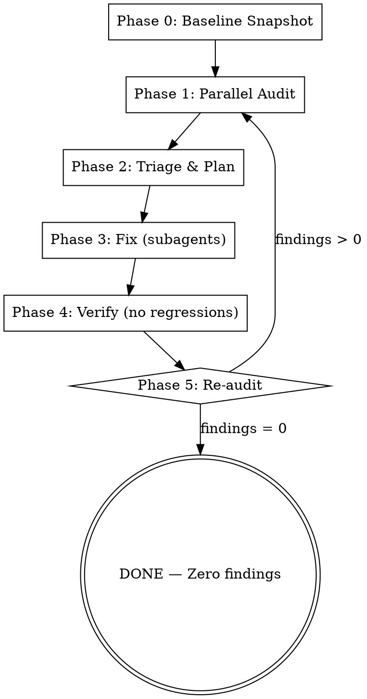

# Deep Safe Refactoring

Autonomous orchestrator that loops until the codebase reaches zero issues across all quality dimensions. Dispatches parallel subagents for every audit pass to keep the orchestrator's context clean and focused. Never ends until all checks pass green.

**Announce:** "Using deep-safe-refactoring to systematically clean the entire codebase."

## Core Principles

1. **Zero-regression guarantee** — full verification after every fix batch
2. **Subagent-first** — every audit and fix runs in a subagent to protect orchestrator context
3. **Infinite loop** — repeat until all passes report zero findings
4. **Skill-powered** — each audit pass invokes the appropriate specialized skill
5. **Parallel when possible** — independent audits run concurrently

## The Loop



## Phase 0: Baseline Snapshot

Before touching anything, capture the current state as the regression baseline.

1. Run the project's full verification suite (read AGENTS.md or project config for commands):
   - Lint/format check
   - Type check
   - Build
   - Tests
2. Record pass/fail counts and any pre-existing failures
3. `git stash` or commit any uncommitted work — start from a clean tree
4. Create a dedicated branch: `git checkout -b refactor/deep-safe-YYYYMMDD`

**The baseline is sacred.** Every fix batch must leave these numbers equal or better — never worse.

## Phase 1: Parallel Audit

Dispatch **one subagent per audit dimension**, all in parallel. Each subagent runs its specialized skill and returns a structured findings report.

### Audit Dimensions & Skill Mapping

| # | Dimension | Skill to Invoke | Subagent Task |
|---|-----------|----------------|---------------|
| 1 | Legacy patterns | `zero-legacy` | Scan for all 20 anti-patterns. Return findings list with file:line. |
| 2 | Code quality & types | `refactor-code-quality` | Scan for type safety, `any`, `as`, dead code, violations. Return findings. |
| 3 | Duplication | `deduplicate` | Find duplicated logic, components, patterns. Return dedup opportunities. |
| 4 | Architecture | `feature-architecture` | Check folder structure, file counts, dependency direction. Return violations. |
| 5 | Variant/styling | `variant-audit` | Scan className overrides, redundant state, missing variants. Return findings. |
| 6 | React health | `react-doctor` | Run `bunx react-doctor@latest . --verbose --diff`. Return score + issues. |
| 7 | Clean code | `clean-code` | Review all code on branch vs main. Return issues found. |
| 8 | Full checks | `check-all` | Run lint, format, types, tests, build. Return any failures. |

**Subagent prompt template for each:**

```
You are an audit subagent. Your ONLY job is to audit — do NOT fix anything.

Invoke the `{SKILL_NAME}` skill in audit/read-only mode.
Scope: {SCOPE — entire codebase, specific directory, or changed files}

Return a structured report:
- Total findings count
- For each finding:
  - File path and line number
  - Category (from the skill's classification)
  - Severity (critical / important / minor)
  - Description (one line)

Do NOT make any edits. Report only.
```

**Dispatch all 8 subagents in a single message** using the Agent tool. Wait for all to complete.

### Scope Control

- **First loop iteration:** Audit the entire codebase
- **Subsequent iterations:** Audit only files changed since last iteration + their dependents (use `git diff --name-only` to get changed files, then trace imports)

## Phase 2: Triage & Plan

Collect all subagent reports. Merge and deduplicate findings (same file:line from multiple audits = one finding).

### Priority Order

1. **Critical** — broken builds, type errors, test failures, security issues
2. **Important** — legacy patterns, duplication, architecture violations, missing variants
3. **Minor** — style inconsistencies, naming, minor redundancies

### Batching Rules

Group fixes into batches that can be applied independently:

- **Same-file fixes** go in the same batch (avoid merge conflicts)
- **Cross-cutting changes** (e.g., renaming a shared type) go in their own batch
- **Max 10-15 files per batch** to keep subagent context manageable
- **Order:** Critical first, then important, then minor

Create a task list (TodoWrite) with one entry per batch.

## Phase 3: Fix (Subagents)

For each batch, dispatch a **fixer subagent**. Use `superpowers:dispatching-parallel-agents` pattern for independent batches.

**Fixer subagent prompt template:**

```
You are a fixer subagent. Fix ONLY the issues listed below — nothing else.

## Rules (from AGENTS.md)
{Paste relevant AGENTS.md rules for the fix category}

## Issues to Fix
{List each finding: file:line, category, description}

## Constraints
- Fix ONLY the listed issues
- Do NOT refactor surrounding code
- Do NOT add features
- Do NOT change public APIs unless the fix requires it
- Invoke `zero-legacy` before writing any code (prevention mode)
- Run the project's format command after fixes

## Output
Return:
- Files changed (list)
- What was fixed (per finding)
- Any findings that could NOT be fixed (with reason)
```

**Parallel vs sequential:**
- Batches touching **different files** → dispatch in parallel
- Batches touching **overlapping files** → dispatch sequentially

After each batch completes, mark the task as done.

## Phase 4: Verify (No Regressions)

**This phase is non-negotiable.** Invoke `superpowers:verification-before-completion` principles.

After ALL fix batches complete:

1. Run the **full verification suite** (same commands as Phase 0):
   - `bun x ultracite fix --unsafe` (lint/format)
   - `turbo check-types` (type check — zero errors)
   - `turbo build` (full build)
   - `turbo test` (all tests pass)
   - `bunx react-doctor@latest . --verbose --diff` (if React files changed, score >= 95)

2. **Compare against baseline:**
   - Test count: must be >= baseline (no deleted tests)
   - Test pass rate: must be >= baseline
   - Type errors: must be <= baseline (ideally 0)
   - Build: must succeed
   - React doctor score: must be >= baseline

3. **If regression detected:**
   - STOP fixing
   - Dispatch a `superpowers:systematic-debugging` subagent to diagnose
   - Fix the regression before proceeding
   - Re-verify

4. **If clean:** Proceed to Phase 5

## Phase 5: Re-Audit (Loop Decision)

Dispatch the **same parallel audit subagents** from Phase 1, scoped to changed files + dependents.

**Decision:**
- **Findings > 0:** Log iteration count, go back to Phase 2
- **Findings = 0 across ALL dimensions:** Exit the loop

### Safety Valve

If the loop has run **5+ iterations** and findings are not converging to zero:
- Present remaining findings to the user
- Ask whether to continue, skip specific findings, or stop
- Some findings may be intentional (e.g., accepted exceptions)

## Completion

When all audits return zero findings:

1. Run final full verification one more time (evidence before claims)
2. Present summary:

```
## Deep Safe Refactoring Complete

### Iterations: {N}
### Total fixes applied: {count}

### By dimension:
- Legacy patterns eliminated: {count}
- Type safety issues fixed: {count}
- Duplications removed: {count}
- Architecture violations fixed: {count}
- Variant/styling issues resolved: {count}
- React doctor score: {before} -> {after}

### Verification:
- Lint/format: PASS
- Types: PASS (0 errors)
- Build: PASS
- Tests: {X}/{X} PASS
- React doctor: {score}/100

### Branch: refactor/deep-safe-YYYYMMDD
```

3. Ask the user how to proceed:
   - Merge to current branch
   - Open a PR
   - Keep the branch for review

## Red Flags — STOP

- **Never** skip Phase 4 verification
- **Never** claim "all clean" without running all audit subagents
- **Never** fix issues in the orchestrator — always dispatch subagents
- **Never** let a fixer subagent exceed its scope
- **Never** delete tests to make the suite pass
- **Never** add `@ts-ignore`, `any`, or suppression comments to "fix" issues
- **Never** proceed to next iteration with failing baseline checks

## Skill Dependencies

This skill orchestrates these skills via subagents:

| Skill | Role |
|-------|------|
| `zero-legacy` | Detect and prevent legacy anti-patterns |
| `refactor-code-quality` | Type safety, dead code, code quality |
| `deduplicate` | Find and eliminate duplication |
| `feature-architecture` | Folder structure and organization |
| `variant-audit` | Styling consistency and redundant state |
| `react-doctor` | React health scoring |
| `clean-code` | AGENTS.md enforcement and best practices |
| `check-all` | Full project verification |
| `simplify` | Code reuse, quality, efficiency review |
| `superpowers:dispatching-parallel-agents` | Parallel subagent pattern |
| `superpowers:verification-before-completion` | Evidence-based completion claims |
| `superpowers:systematic-debugging` | Regression diagnosis |
