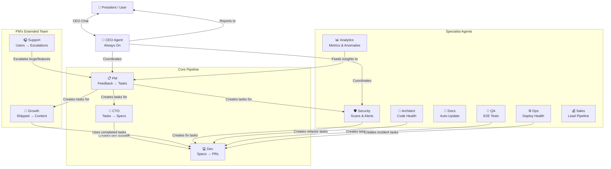
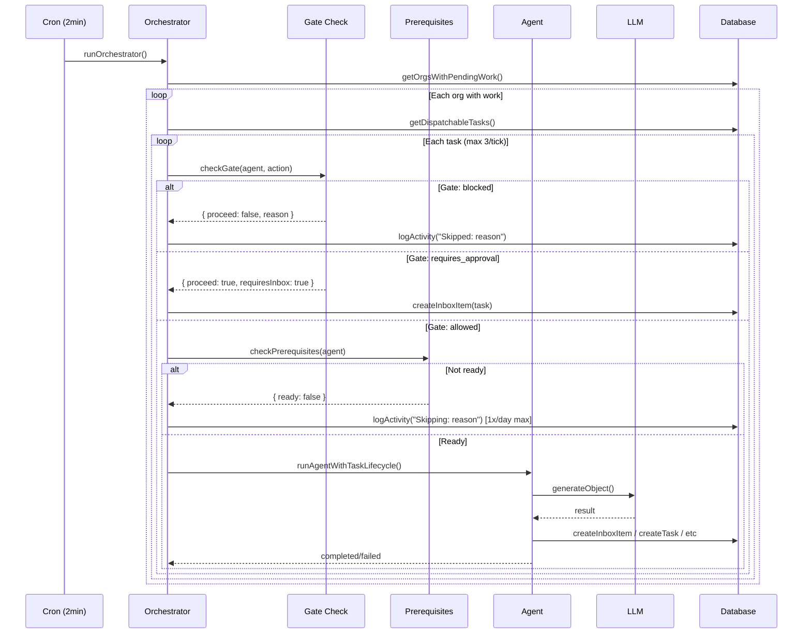
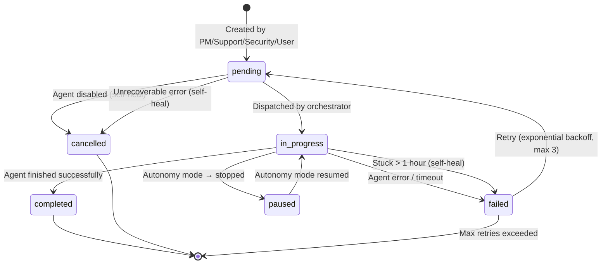
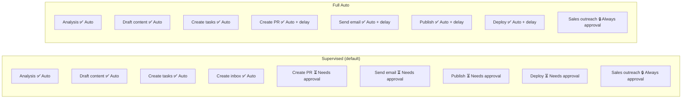
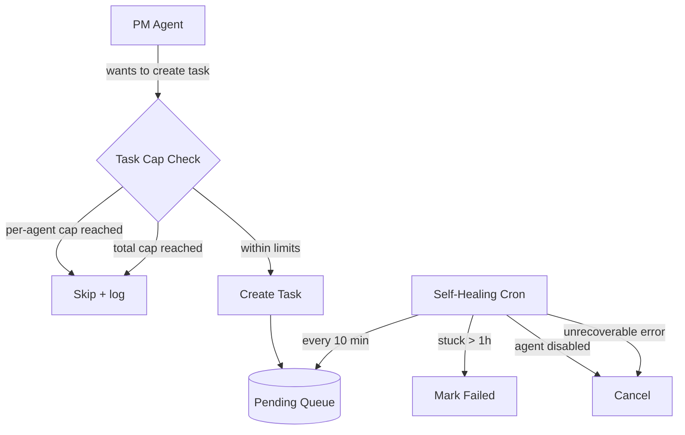

# Autopilot Architecture

Living document — maintain whenever the architecture changes.

## Agent Hierarchy & Communication



## Orchestration Flow



## Task Lifecycle



## Autonomy Modes



## Task Cap System (V8)



**Default Caps:**
- Max pending per agent: **2**
- Max total pending: **5**

## Prerequisites System (V8)

Each agent checks for required data before calling the LLM:

| Agent | Prerequisite | What it checks |
|-------|-------------|----------------|
| Ops | Real deployment data | OpsSnapshots with deployCount > 0 |
| Analytics | User metrics | AnalyticsSnapshots with activeUsers > 0 |
| Growth | Completed work | Completed tasks in last 7 days or feedback |
| Docs | Shipped changes | Completed tasks or support conversations |
| QA | Task specs | Pending QA tasks with acceptance criteria |
| Sales | Leads exist | At least one lead in the pipeline |
| Support | Always ready | Gracefully handles empty conversations |
| Dev | Adapter credentials | Valid credentials for configured adapter |

When prerequisites fail: no LLM call, one log message per 24h max.

## Cron Schedule

| Cron | Interval | Agent | What |
|------|----------|-------|------|
| Orchestrator | 2 min | system | Dispatch pending tasks |
| Self-healing | 10 min | system | Clean stuck/orphaned tasks |
| CEO coordination | 30 min | CEO | Cross-agent health check |
| PM analysis | 6 hours | PM | Scan feedback → create tasks |
| Ops monitoring | 1 hour | Ops | Check deployments |
| Ops snapshot | Daily 23:00 | Ops | Capture daily metrics |
| Security scan | Daily 07:00 | Security | Full OWASP scan |
| Architect review | Weekly Wed | Architect | Code health review |
| Analytics snapshot | Daily 07:30 | Analytics | Capture metrics |
| Analytics brief | Weekly Mon | Analytics | Weekly trends report |
| Docs stale check | Weekly Wed | Docs | Find outdated docs |
| Support triage | Daily 10:00 | Support | Fallback scan (event-driven primary) |
| Shipped notifications | Daily 11:00 | Support | Notify users of shipped features |
| Sales follow-up | Daily 09:00 | Sales | Check follow-up queue |
| CEO daily report | Daily 08:00 | CEO | Generate daily report |
| CEO weekly report | Weekly Mon | CEO | Generate weekly report |
| Inbox expiration | Daily 01:00 | system | Expire old pending items |
| Cost reset | Daily 00:00 | system | Reset daily cost counters |
| Intelligence scans | Daily 06:00 | system | Competitor analysis |
| Intelligence digest | Weekly Mon | system | Weekly intelligence report |

## File Structure

```
packages/backend/convex/autopilot/
├── prerequisites.ts      ← V8: Agent readiness checks
├── self_heal.ts          ← V8: Stuck task cleanup cron
├── tableFields.ts        ← Table schemas & validators
├── config.ts             ← Config management & task cap queries
├── tasks.ts              ← Task DAG management (with cap enforcement)
├── gate.ts               ← Universal autonomy gate
├── crons.ts              ← Orchestrator & cron handlers
├── mutations.ts          ← Frontend-facing mutations
├── queries.ts            ← Frontend-facing queries
├── inbox.ts              ← Inbox item management
├── dedup.ts              ← Duplicate detection
├── execution.ts          ← Task execution via adapters
├── autonomy.ts           ← Autonomy mode logic
├── cost_guard.ts         ← Cost tracking & daily caps
├── agents/
│   ├── pm.ts             ← Product prioritization + cap awareness
│   ├── cto.ts            ← Technical spec generation
│   ├── ceo.ts            ← Cross-agent coordination
│   ├── ops.ts            ← Deploy health (with prerequisites)
│   ├── analytics.ts      ← Metrics (with prerequisites)
│   ├── growth.ts         ← Content generation (with prerequisites)
│   ├── support.ts        ← Conversation triage
│   ├── sales.ts          ← Lead pipeline (with prerequisites)
│   ├── docs.ts           ← Doc freshness (with prerequisites)
│   ├── qa.ts             ← E2E test generation
│   ├── security.ts       ← Vulnerability scanning
│   ├── architect.ts      ← Code health review
│   ├── models.ts         ← LLM model definitions
│   ├── prompts.ts        ← Agent system prompts
│   └── shared.ts         ← Common utilities
├── adapters/             ← Coding adapter implementations
└── intelligence/         ← Competitor analysis module
```
