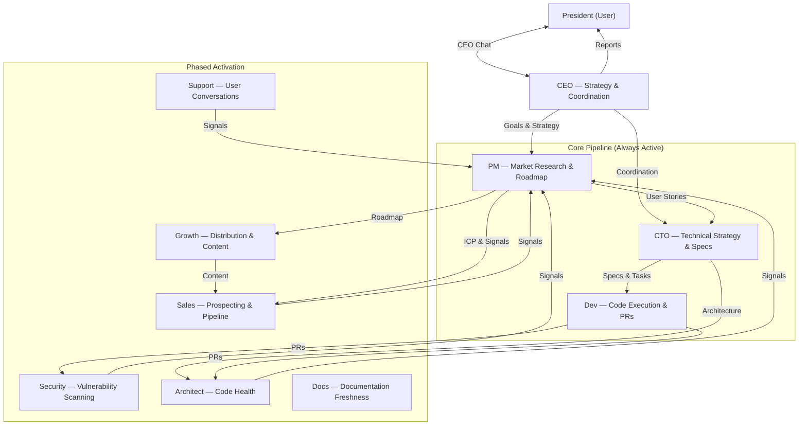
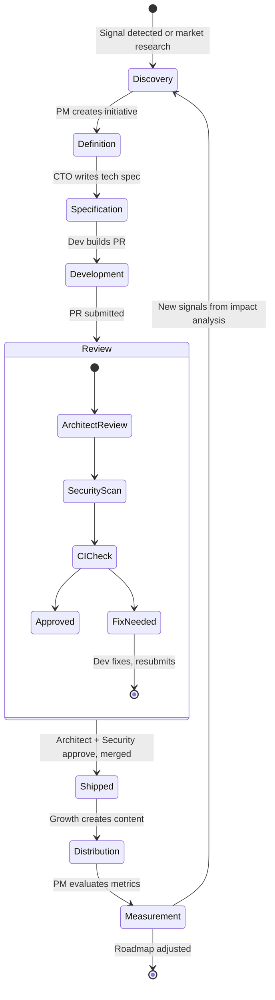
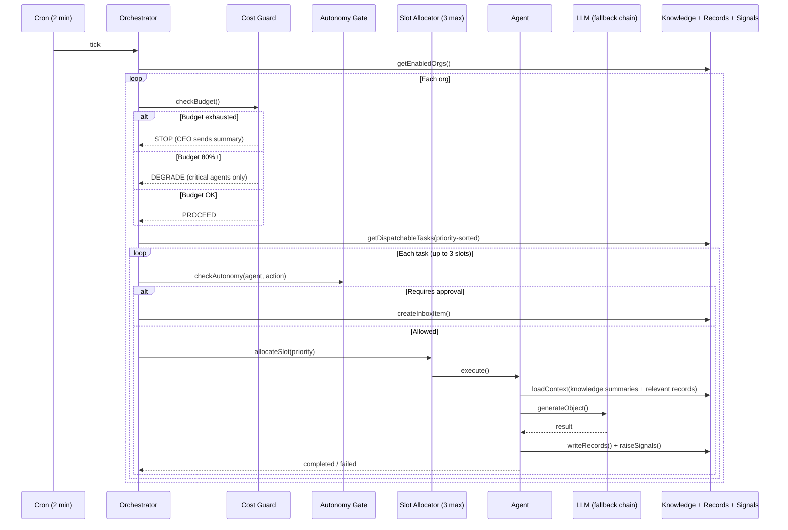
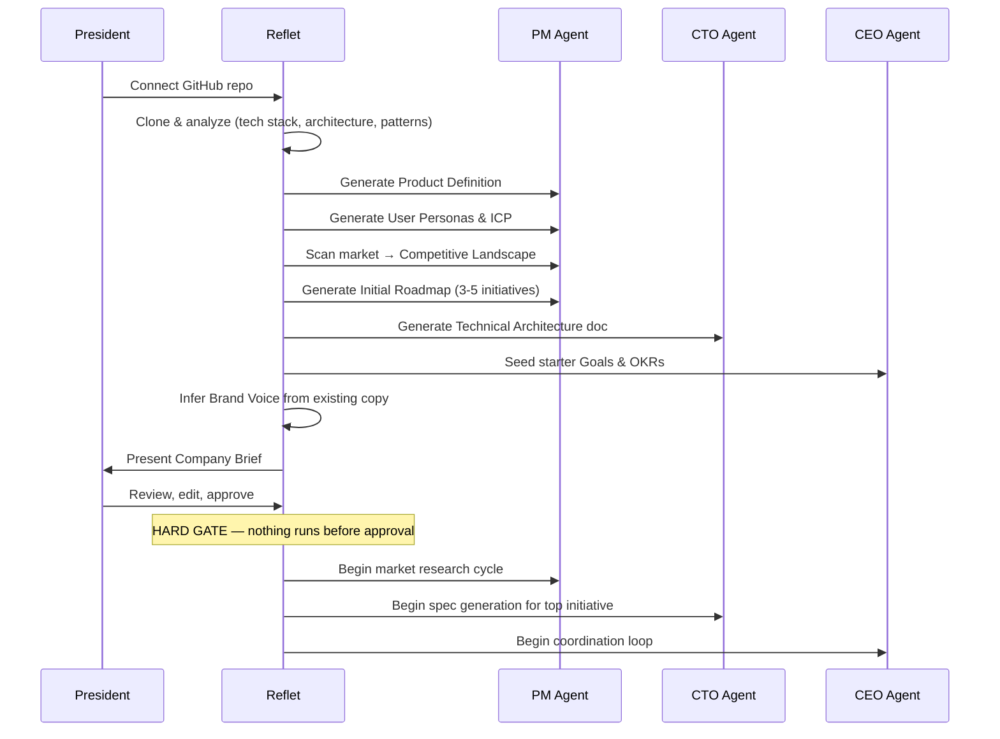
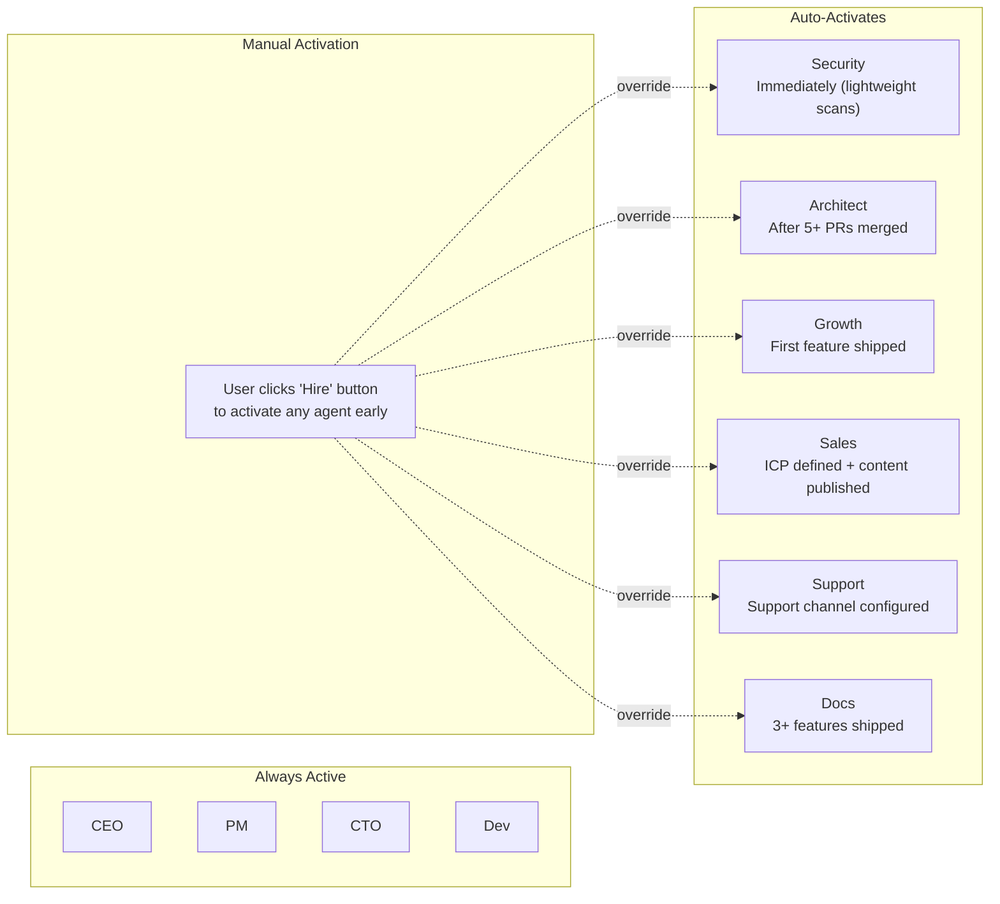
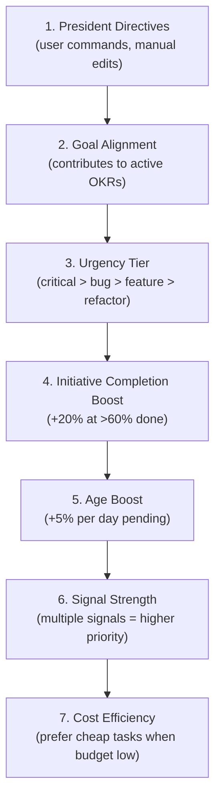
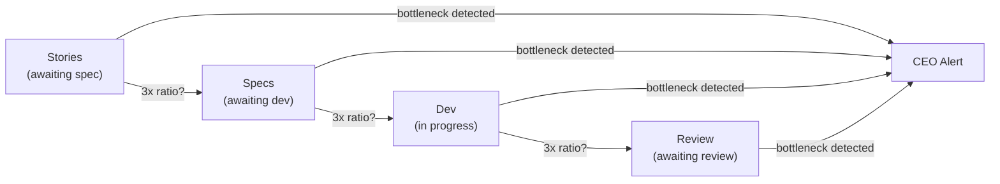
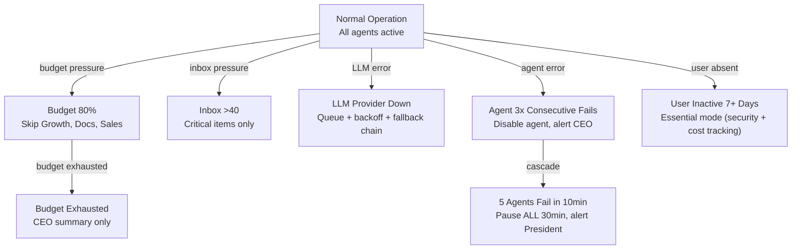

# Autopilot Architecture

Living document — maintain whenever the architecture changes.

## System Overview

Reflet Autopilot is an autonomous company operating system. It takes a single input — a GitHub repository — and produces a fully functioning product company with specialized AI agents that research, build, ship, grow, and sell autonomously.

The architecture is built on three principles:
1. **Shared knowledge, exclusive tools** — every agent reads everything, but each agent writes only to its own domain
2. **Never block, always degrade** — hard limits everywhere, graceful fallbacks when resources are constrained
3. **Proactive by default** — agents discover work, they don't wait for it

## Agent Hierarchy



## Three Data Layers

```mermaid
graph TB
    subgraph "Layer 1: Knowledge Base"
        direction LR
        PD["Product Definition"]
        ICP["User Personas & ICP"]
        CL["Competitive Landscape"]
        BV["Brand Voice"]
        TA["Technical Architecture"]
        GOALS["Goals & OKRs"]
        ROAD["Product Roadmap"]
    end

    subgraph "Layer 2: Structured Records"
        direction LR
        INIT["Initiatives"]
        STORIES["User Stories"]
        SPECS["Technical Specs"]
        TASKS["Dev Tasks"]
        PRS["Pull Requests"]
        LEADS["Leads & Contacts"]
        FINDINGS["Security Findings"]
        THREADS["Support Threads"]
        CONTENT["Content Items"]
        ADRS["Architecture Decisions"]
        DOCPAGES["Doc Pages"]
    end

    subgraph "Layer 3: Signals"
        direction LR
        MO["Market Opportunity"]
        FRP["Feature Request Pattern"]
        TD["Technical Debt"]
        SA["Security Alert"]
        CM["Competitive Move"]
        USS["User Sentiment Shift"]
        GI["Growth Insight"]
        IP["Initiative Proposal"]
    end

    AGENTS["All Agents READ all layers"]
    AGENTS -.->|"read"| PD
    AGENTS -.->|"read"| INIT
    AGENTS -.->|"read"| MO

    PM_W["PM writes"] -->|"exclusive"| PD
    PM_W -->|"exclusive"| ICP
    PM_W -->|"exclusive"| CL
    PM_W -->|"exclusive"| ROAD
    PM_W -->|"exclusive"| INIT
    PM_W -->|"exclusive"| STORIES

    ANY["Any Agent writes"] -->|"open"| MO
    ANY -->|"open"| IP
```



### Layer 1: Knowledge Base (Living Foundations)

Auto-generated at onboarding, maintained by owning agents, read by all.

| Document | Owner | Staleness Alert |
|----------|-------|-----------------|
| Product Definition | PM | 14 days |
| User Personas & ICP | PM | 14 days |
| Competitive Landscape | PM | 7 days |
| Brand Voice & Guidelines | Growth | 30 days |
| Technical Architecture | CTO + Architect | 14 days |
| Goals & OKRs | CEO | 30 days |
| Product Roadmap | PM | 7 days |

**Rules:**
- Every update creates a version (max 10 versions retained)
- User edits set `userEdited: true` — agents cannot overwrite for 72 hours
- Authority hierarchy: President directives > CEO strategy > PM decisions > agent analysis
- Agents load summaries by default (200 words), full doc only for their own domain

### Layer 2: Structured Records (Exclusive Ownership)

Strict schemas, single owning agent, everyone reads.

| Record | Owner (write) | Key readers |
|--------|--------------|-------------|
| Initiatives | PM | CTO, CEO, Growth, everyone |
| User Stories | PM | CTO, Dev |
| Technical Specs | CTO | Dev, Architect |
| Dev Tasks | CTO | Dev, Architect |
| Pull Requests | Dev | Architect, Security, CTO |
| Leads & Contacts | Sales | CEO, Growth |
| Security Findings | Security | CTO, Dev, Architect |
| Support Threads | Support | PM, CEO |
| Content Items | Growth | CEO |
| Architecture Decisions | Architect | CTO, Dev |
| Doc Pages | Docs | Support, PM |

### Layer 3: Signals (Bottom-Up Initiative)

Any agent can create signals. PM triages during analysis cycles.

| Signal Type | Typical sources |
|-------------|----------------|
| `market_opportunity` | PM, Growth, Sales |
| `feature_request_pattern` | Support, Sales |
| `technical_debt` | Architect, CTO, Dev |
| `security_alert` | Security |
| `competitive_move` | PM, Growth |
| `user_sentiment_shift` | Support, Sales |
| `growth_insight` | Growth |
| `initiative_proposal` | Any agent |

**Deduplication:** Before creating a signal, check for >80% content similarity within 7 days. If found, merge (increment `strength` counter) instead of creating new.

## Feature Lifecycle



### Lifecycle Rules

- Within a single story: **strictly sequential** (Definition → Spec → Build → Review → Ship)
- Across stories in one initiative: **pipelined** (Story 1 in Build while Story 2 in Spec)
- Across initiatives: **fully parallel** (Initiative A in Dev, Initiative B in Discovery)
- Max 5 active stories per initiative (WIP limit)
- Max 3 active initiatives (focus limit)

## Orchestration Flow



### Slot Allocation

3 concurrent execution slots per org per tick, allocated by priority:
- **Slot 1:** Highest priority dispatchable task (any agent)
- **Slot 2:** Second highest (different initiative preferred)
- **Slot 3:** Background work (scans, research, content generation)

If fewer than 3 tasks are dispatchable, remaining slots stay empty.

## Onboarding Sequence



**Timeout:** 10 minutes max for analysis. If the repo is too large, analyze top-level structure and defer deep analysis to background.

## Agent Activation



**Rules:**
- Dormant agents still **read** knowledge base (they build context before activation)
- Deactivating an agent **pauses** tasks (not cancels) and preserves all data
- Reactivation resumes from current state

## Context Window Management

Each agent has a token budget for context loading:

| Context Tier | Max Tokens | Contents |
|-------------|-----------|----------|
| Always loaded | ~2000 | Product Definition (summary), Goals, active President directives |
| Domain-relevant | ~4000 | Agent's own knowledge docs (full), related records |
| Situational | ~3000 | Relevant signals (last 48h), cross-agent records |
| Task-specific | ~4000 | The specific work item being processed |
| **Total ceiling** | **~13K** | Before the agent's own system prompt |

**Rules:**
- Knowledge docs loaded as 200-word summaries unless agent owns the doc
- Records capped at most recent N items, not all
- Signals limited to last 48 hours
- Old data loaded only on explicit need (e.g., PM reviewing historical trends)

## Hard Limits

| Limit | Default | Configurable | Purpose |
|-------|---------|-------------|---------|
| Active initiatives | 3 | Yes (1-10) | Focus — finish before starting |
| User stories per initiative | 20 | No | Split if larger |
| Active stories per initiative | 5 | Yes (3-10) | WIP control |
| Open PRs | 3 | Yes (1-10) | Review bottleneck prevention |
| Concurrent agent executions | 3 | Yes (1-5) | Resource control |
| Pending tasks per agent | 3 | Yes (1-10) | Anti-hogging |
| Pending tasks total | 15 | Yes (5-50) | Bounded backlog |
| Signals per agent per day | 20 | No | Anti-spam |
| Signals total per day | 100 | No | Hard ceiling |
| Sales outreach per day | 10 | Yes (0-50) | Reputation |
| Content items per day | 5 | Yes (0-20) | Quality > quantity |
| LLM calls per agent per hour | 10 | No | Loop prevention |
| Daily cost cap | $20 | Yes (by plan) | Budget |
| 5-minute cost rate | $2 max | No | Runaway prevention |
| Task retries | 3 | No | Backoff: 1min, 5min, 30min |
| Circuit breaker | 5 fails / 10min | No | Cascade prevention |
| Inbox pressure throttle | 20 / 40 / 60 | Yes | Overwhelm prevention |
| Knowledge doc versions | 10 | No | Storage |
| Signal retention (unacted) | 30 days | No | Hygiene |
| Signal retention (dismissed) | 7 days | No | Cleanup |
| Activity log retention | 90 days | No | Cleanup |
| Onboarding timeout | 10 min | No | Hang prevention |
| User edit protection | 72 hours | No | Respect user changes |

## Priority System



### Anti-Starvation

- Tasks gain +5% effective priority per day pending
- At least 1 of 3 execution slots goes to non-urgent work (unless 3+ critical items exist)
- CEO coordination detects starvation: any task pending >3 days triggers alert

### Finish-What-You-Started

- Tasks for initiatives >60% complete get +20% priority boost
- System prefers completing 1 initiative over advancing 3 initiatives 20% each
- New initiative creation blocked when 3 initiatives are already active

## Bottleneck Detection

The CEO coordination loop (every 4 hours) monitors pipeline health:



**Rules:**
- If any stage has >3x items compared to the next stage → bottleneck alert
- If any initiative hasn't progressed in 3 days → stuck alert
- If Dev has no specs to build → Dev picks up maintenance (refactoring, deps, tests)

## Graceful Degradation



## Cron Schedule

| Cron | Interval | Agent | Purpose |
|------|----------|-------|---------|
| Orchestrator | 2 min | system | Dispatch pending tasks, allocate slots |
| Self-healing | 10 min | system | Clean stuck/orphaned tasks, circuit breaker |
| CEO coordination | 4 hours | CEO | Bottleneck detection, conflict resolution, health |
| PM market research | 6 hours | PM | Proactive market scanning, signal triage |
| Security scan | Daily | Security | Dependency + OWASP + secrets scan |
| Architect review | Weekly | Architect | Code health audit |
| Growth content | Daily | Growth | Find distribution channels, generate content |
| Sales prospecting | Daily | Sales | Discover prospects, manage follow-ups |
| Support triage | Event-driven + daily fallback | Support | Handle conversations |
| Docs stale check | Weekly | Docs | Find outdated documentation |
| CEO daily report | Daily 08:00 | CEO | Summary for President |
| CEO weekly report | Weekly Monday | CEO | Weekly strategic review |
| Inbox expiration | Daily 01:00 | system | Expire old pending items |
| Cost reset | Daily 00:00 | system | Reset daily budgets |
| Signal cleanup | Daily 02:00 | system | Archive/delete old signals |
| Knowledge staleness | Daily 03:00 | system | Flag stale knowledge docs |

## File Structure

```
packages/backend/convex/autopilot/
├── tableFields.ts            ← Schemas & validators for all three layers
├── config.ts                 ← Org configuration, agent toggles, limits
├── onboarding.ts             ← Repo analysis → Company Brief generation
├── knowledge.ts              ← Knowledge base CRUD, versioning, staleness
├── records.ts                ← Structured record helpers, ownership enforcement
├── signals.ts                ← Signal creation, dedup, triage, cleanup
├── gate.ts                   ← Autonomy gate (supervised / full-auto / stopped)
├── crons.ts                  ← Orchestrator, slot allocation, cron handlers
├── inbox.ts                  ← Inbox management, pressure tracking, expiry
├── tasks.ts                  ← Task lifecycle, DAG, WIP enforcement
├── cost_guard.ts             ← Per-agent budgets, rate limits, circuit breaker
├── self_heal.ts              ← Stuck task cleanup, cascade detection
├── priorities.ts             ← Priority scoring formula, anti-starvation
├── execution.ts              ← Coding adapter dispatch
├── mutations.ts              ← Frontend-facing mutations
├── queries.ts                ← Frontend-facing queries
├── agents/
│   ├── ceo.ts                ← Coordination, reports, directive relay
│   ├── pm.ts                 ← Market research, roadmap, signal triage
│   ├── cto.ts                ← Spec generation, technical strategy
│   ├── dev.ts                ← PR creation via adapters
│   ├── security.ts           ← Vulnerability scanning
│   ├── architect.ts          ← Code health, ADRs
│   ├── growth.ts             ← Content generation, distribution
│   ├── sales.ts              ← Prospecting, pipeline, outreach
│   ├── support.ts            ← Conversation triage, escalation
│   ├── docs.ts               ← Documentation freshness
│   ├── models.ts             ← LLM model definitions & fallback chains
│   ├── prompts.ts            ← Agent system prompts with knowledge loading
│   └── shared.ts             ← Common utilities
└── adapters/                 ← Coding adapter implementations
```
