# Autopilot Architecture — Graphs

No orchestrator. Agents own their work, wake on conditions, communicate through a shared board. Guards ensure safety as middleware, not gatekeepers.

---

## 1. Core Model — Self-Directed Agents

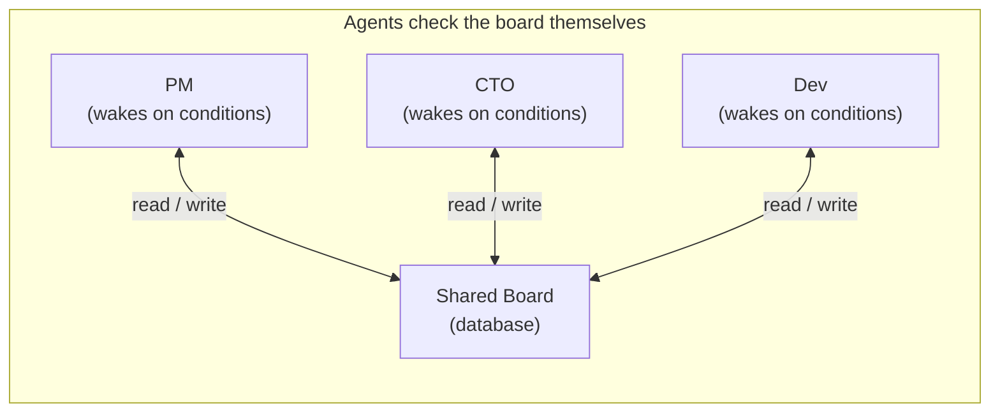

No orchestrator. No dispatcher. Each agent owns its schedule, checks the shared board, and does its work — like employees in a real company.

---

## 2. The Shared Board — Read Everything, Write Your Domain

Every agent reads the entire board. But writing is restricted — each agent can only write to its own domain, for both records and notes.

```mermaid
graph TB
    subgraph "Knowledge Base (wiki — exclusive owner writes)"
        PD["Product Definition (PM)"]
        ICP["User Personas & ICP (PM)"]
        CL["Competitive Landscape (PM)"]
        BV["Brand Voice (Growth)"]
        TA["Technical Architecture (CTO + Architect)"]
        GOALS["Goals & OKRs (CEO)"]
        ROAD["Product Roadmap (PM)"]
    end

    subgraph "Work Board (structured records — exclusive owner writes)"
        INIT["Initiatives (PM)"]
        STORIES["User Stories (PM)"]
        SPECS["Technical Specs (CTO)"]
        PRS["Pull Requests (Dev)"]
        COMP["Competitors (Growth)"]
        LEADS["Leads (Sales)"]
        FINDINGS["Security Findings (Security)"]
        CONTENT["Content Items (Growth)"]
        THREADS["Support Threads (Support)"]
        ADRS["Architecture Decisions (Architect)"]
        DOCPAGES["Doc Pages (Docs)"]
    end

    subgraph "Documents (Notion-like — any agent creates)"
        D_MR["Market Research (Growth)"]
        D_BC["Battlecards (Sales)"]
        D_AA["Architecture Analysis (Architect)"]
        D_ANY["Any type — freeform"]
    end

    subgraph "Notes (quick observations — domain-restricted)"
        NOTES["Each agent writes in its domain"]
    end

    subgraph "Inbox (user approvals)"
        INB["PRs, content, outreach, reports"]
    end

    ALL["All agents READ everything"]
    ALL -.-> PD & INIT & D_MR & NOTES & INB
```

---

## 3. Condition-Driven Agent Wake

No crons. A heartbeat checks conditions and wakes agents when there's a reason.

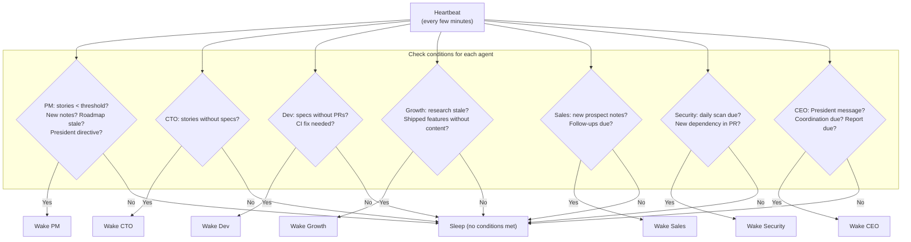

---

## 4. Agent Execution Flow (Every Agent, Every Time)

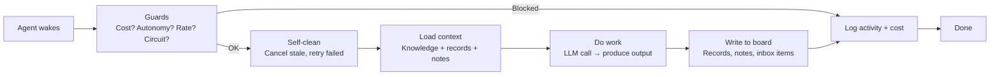

---

## 5. PM + Growth Collaboration

Growth researches the market. PM makes product decisions from Growth's findings. Like a real company.

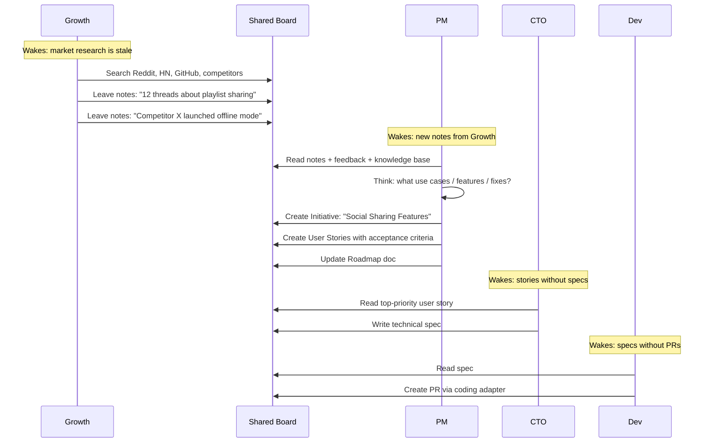

---

## 6. CEO Relay — President Commands Flow to Agents

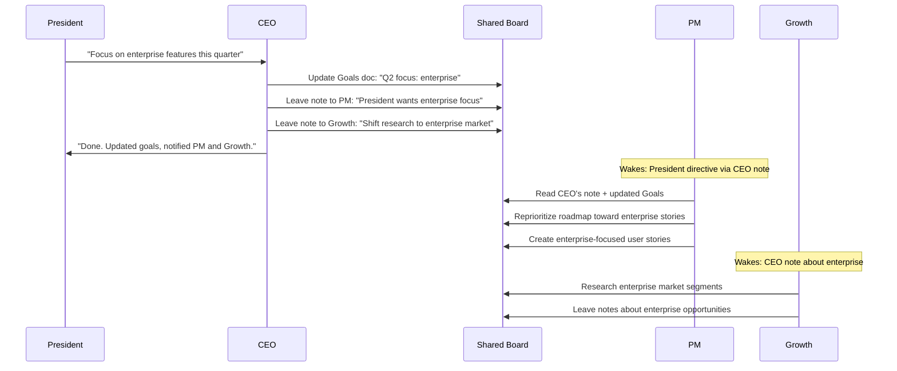

---

## 7. Onboarding — No Hard Gate

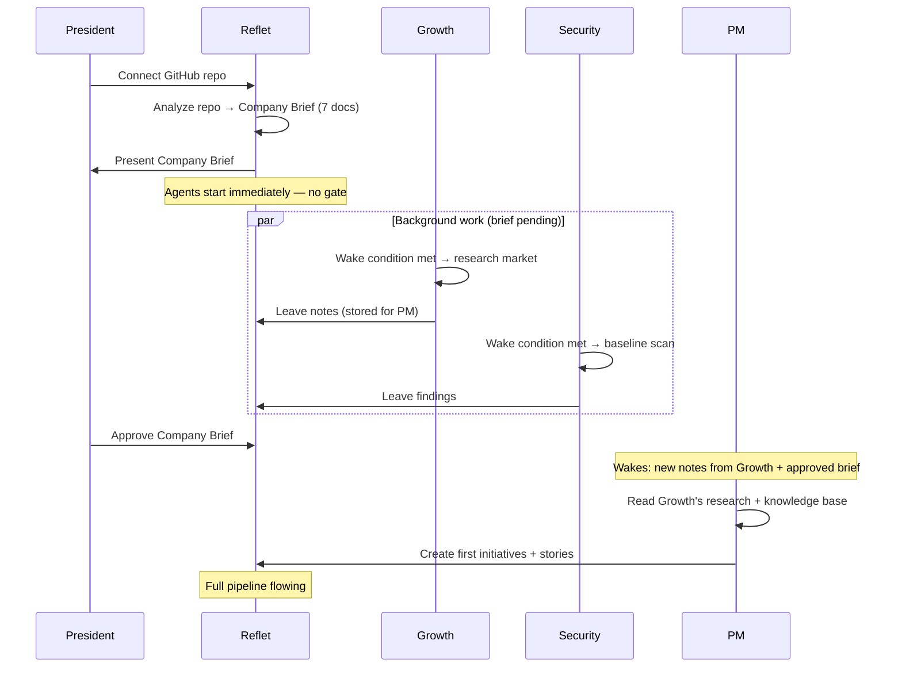

---

## 8. Self-Cleaning

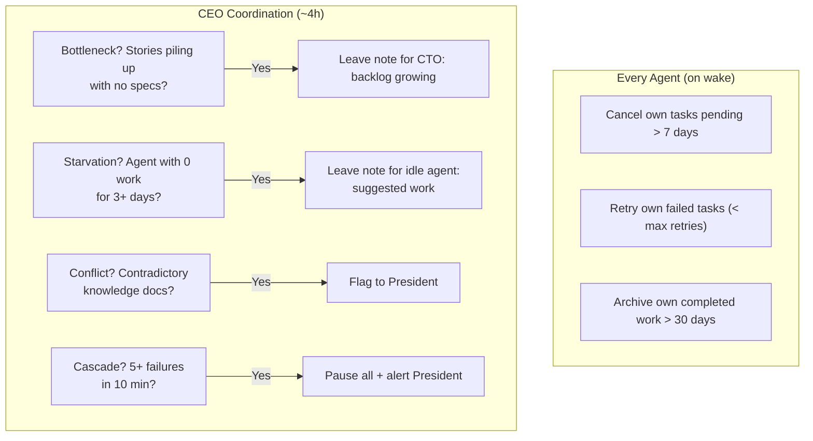

---

## 9. Guards — Middleware, Not Orchestrator

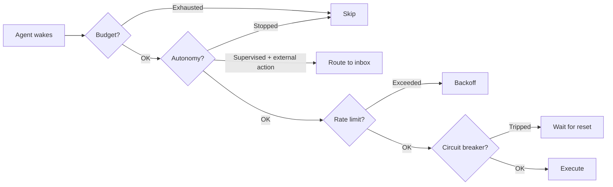

---

## 10. Full System

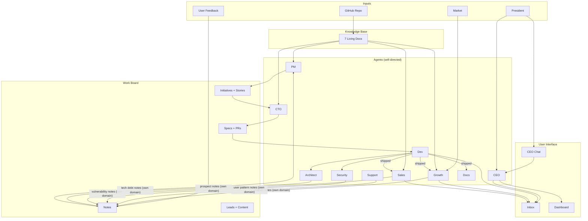

---

## 11. Self-Correcting Company — Knowledge Change Cascade

When the Product Definition changes (pivot, new feature focus, scope change), everything downstream adapts automatically.

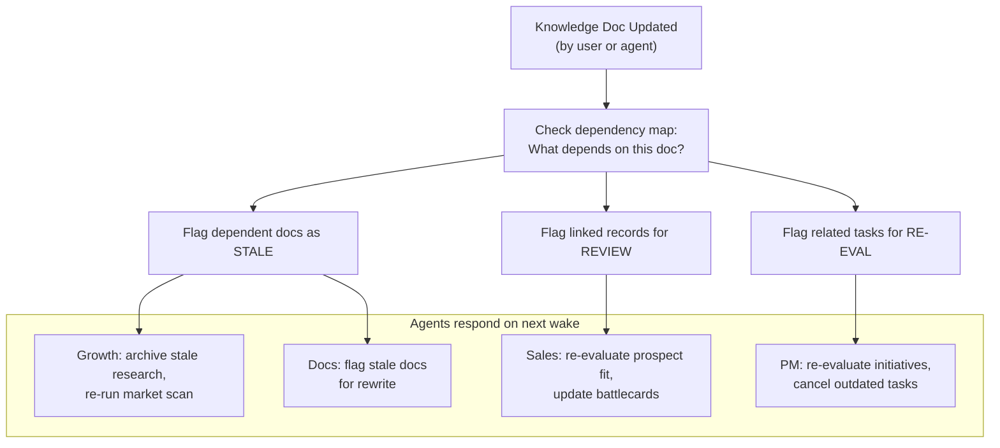

## 12. Bottom-Up Change Propagation

Agents can propose changes to the Knowledge Base, not just leave notes.

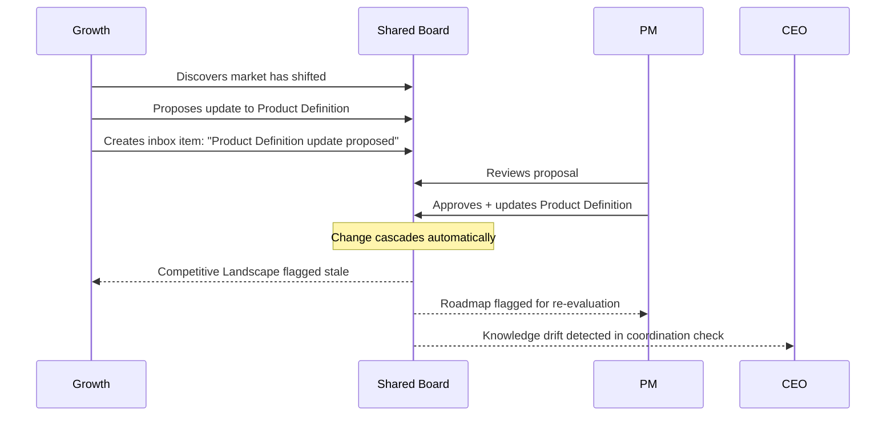

## 13. Why This Can't Stop

| Failure mode | Why it can't happen |
|---|---|
| PM finds nothing → 0 tasks | PM reads Growth's notes + Knowledge Base. Growth researches daily. Pipeline never empty. |
| No orchestrator → nothing runs | Each agent owns its schedule via heartbeat conditions. No central point of failure. |
| Company Brief not approved → blocked | No hard gate. Agents work in background. Brief approval unlocks full pipeline. |
| Task caps full with stale work | Each agent cleans own stale tasks on every wake. Caps count pending + in_progress. |
| One agent fails → cascade | Agents are independent. One failing doesn't affect others. CEO detects patterns. |
| No market research → no leads | Growth researches market independently. Sales also discovers its own leads from GitHub/community. |
| President goes silent | Company keeps running on its own strategy. CEO sends weekly digest to re-engage. |
| Product pivots → old work invalid | Knowledge change cascade automatically flags stale data. Agents archive old work and re-align. |
| Agent uses wrong product context | No silent fallbacks — agents halt if knowledge is missing. No generic placeholder text anywhere. |
| Bottom-up insight contradicts strategy | Agents propose knowledge doc updates. PM/CEO approves. Cascade realigns the company. |
