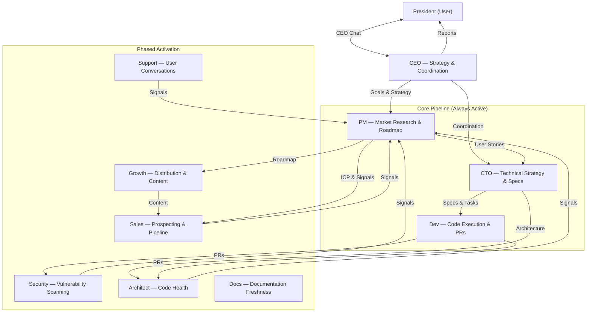
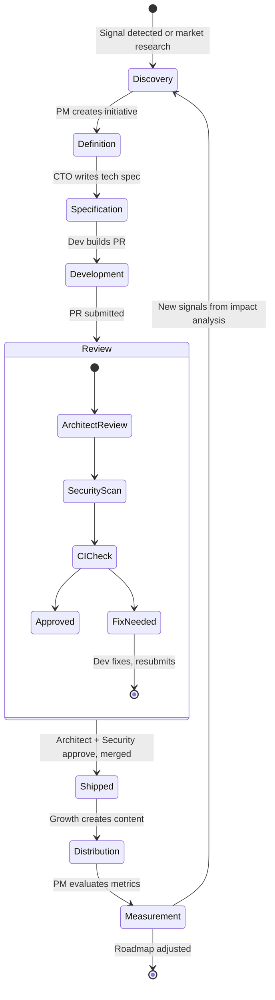
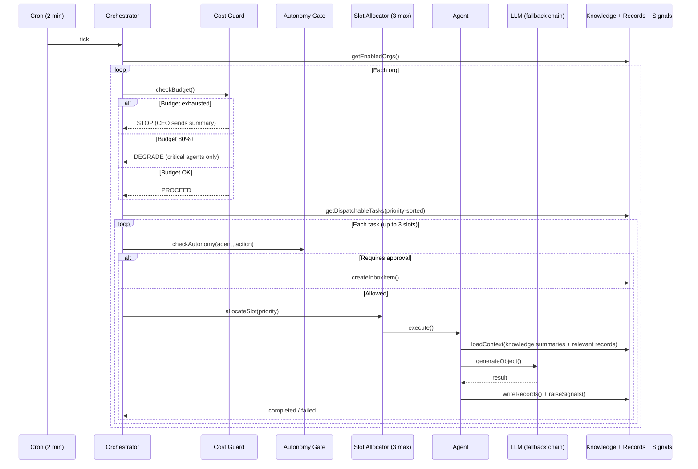
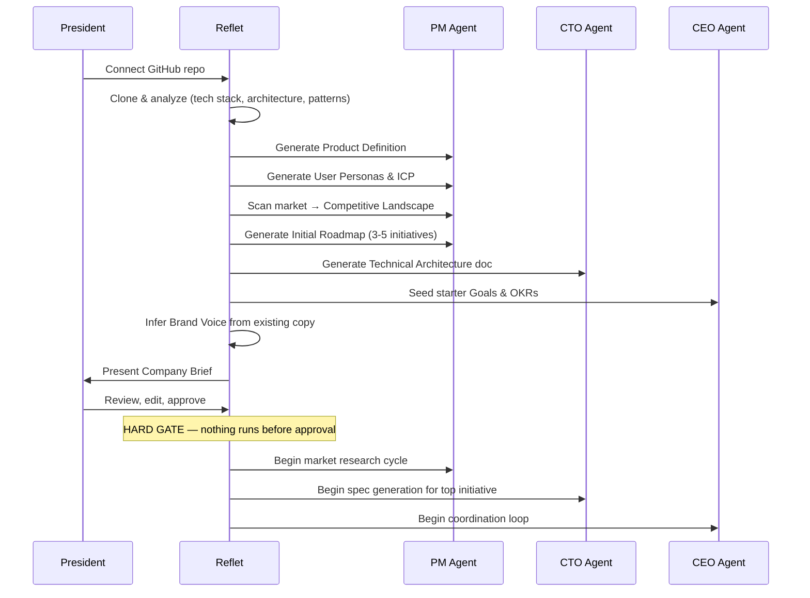
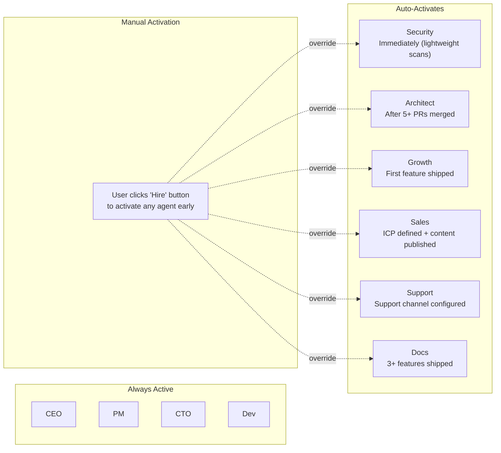
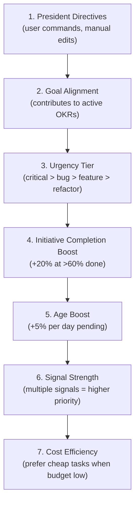
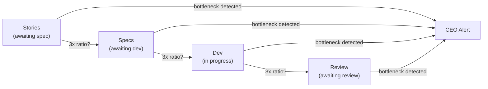
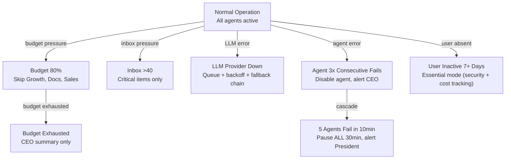

# Autopilot Architecture — Mermaid Graphs (Current)

## Agent Hierarchy

## Three Data Layers

```mermaid
graph TB
    subgraph "Layer 1: Knowledge Base"
        direction LR
        PD["Product Definition"]
        ICP["User Personas & ICP"]
        CL["Competitive Landscape"]
        BV["Brand Voice"]
        TA["Technical Architecture"]
        GOALS["Goals & OKRs"]
        ROAD["Product Roadmap"]
    end

    subgraph "Layer 2: Structured Records"
        direction LR
        INIT["Initiatives"]
        STORIES["User Stories"]
        SPECS["Technical Specs"]
        TASKS["Dev Tasks"]
        PRS["Pull Requests"]
        LEADS["Leads & Contacts"]
        FINDINGS["Security Findings"]
        THREADS["Support Threads"]
        CONTENT["Content Items"]
        ADRS["Architecture Decisions"]
        DOCPAGES["Doc Pages"]
    end

    subgraph "Layer 3: Signals"
        direction LR
        MO["Market Opportunity"]
        FRP["Feature Request Pattern"]
        TD["Technical Debt"]
        SA["Security Alert"]
        CM["Competitive Move"]
        USS["User Sentiment Shift"]
        GI["Growth Insight"]
        IP["Initiative Proposal"]
    end

    AGENTS["All Agents READ all layers"]
    AGENTS -.->|"read"| PD
    AGENTS -.->|"read"| INIT
    AGENTS -.->|"read"| MO

    PM_W["PM writes"] -->|"exclusive"| PD
    PM_W -->|"exclusive"| ICP
    PM_W -->|"exclusive"| CL
    PM_W -->|"exclusive"| ROAD
    PM_W -->|"exclusive"| INIT
    PM_W -->|"exclusive"| STORIES

    ANY["Any Agent writes"] -->|"open"| MO
    ANY -->|"open"| IP
```

## Feature Lifecycle

## Orchestration Flow

## Onboarding Sequence

## Agent Activation

## Priority System

## Bottleneck Detection

## Graceful Degradation

