# Autopilot Architecture — Graphs

No orchestrator. Agents own their work, wake on conditions, communicate through a shared board. Two unified data models: WorkItems (hierarchy) + Documents (content). Guards ensure safety as middleware.

---

## 1. Core Model — Self-Directed Agents + Unified Data

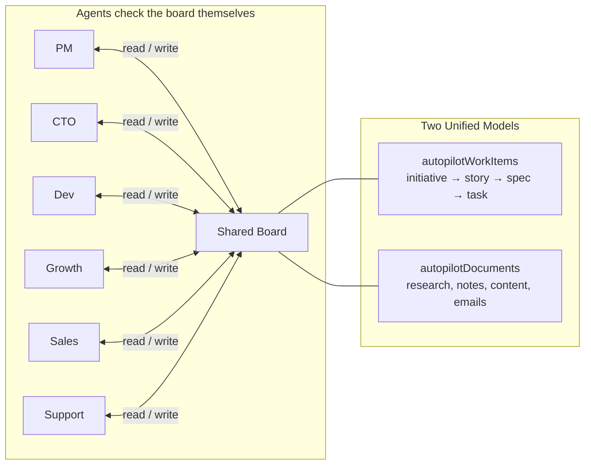

---

## 2. The Shared Board — Unified Data Models

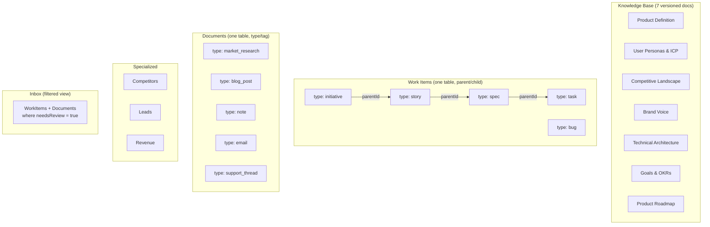

---

## 3. Work Item Hierarchy

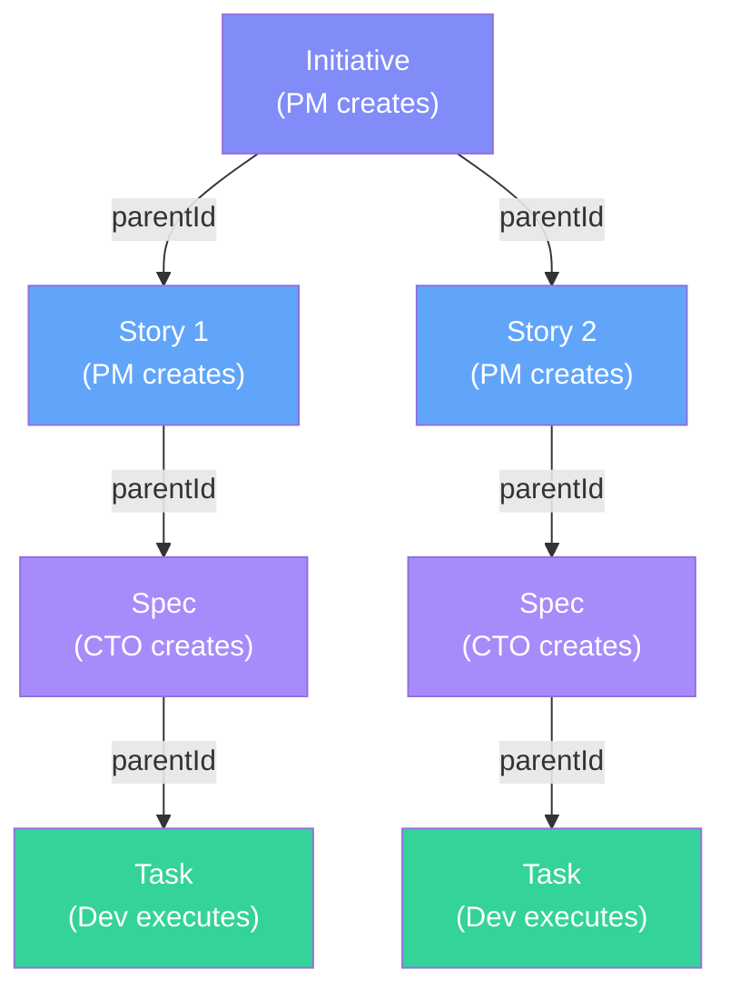

---

## 4. Work-Driven Agent Wake (No Time Fallbacks)

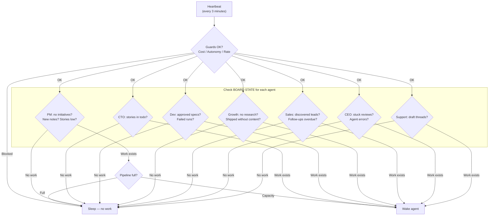

---

## 5. Agent Execution Flow

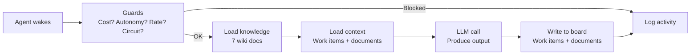

---

## 6. PM + Growth Pipeline

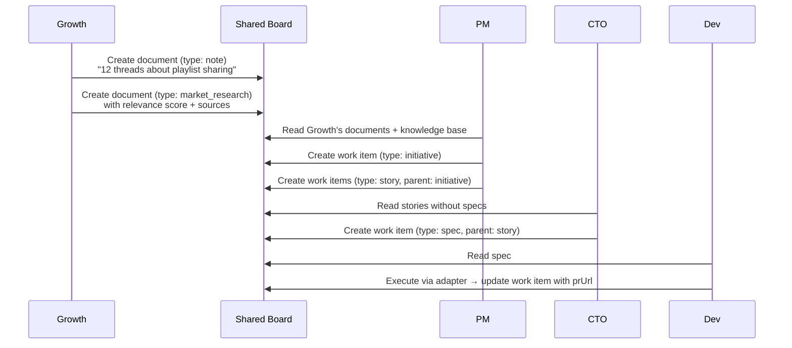

---

## 7. CEO Relay

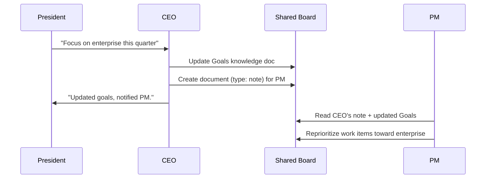

---

## 8. Inbox Flow (needsReview flag)

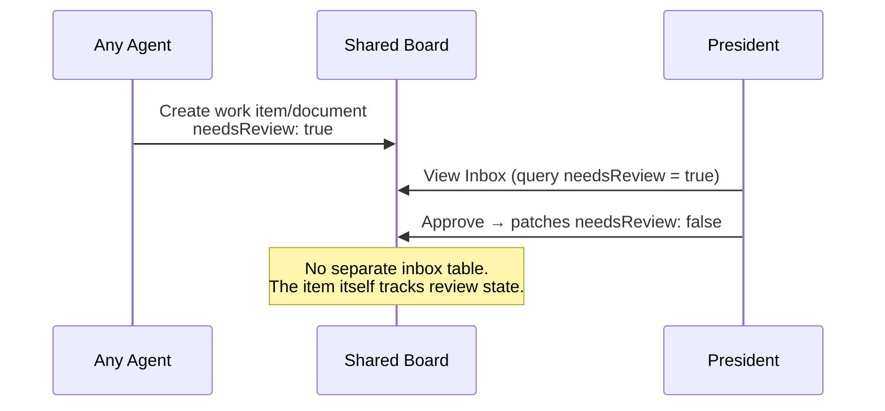

---

## 9. Guards — Middleware, Not Orchestrator

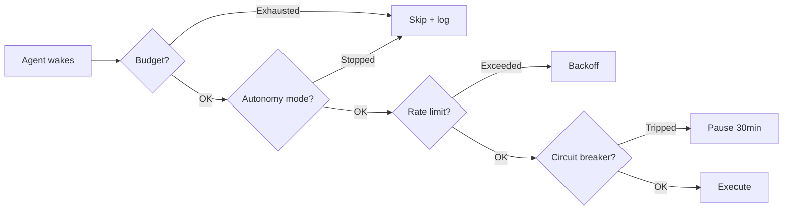

---

## 10. Full System

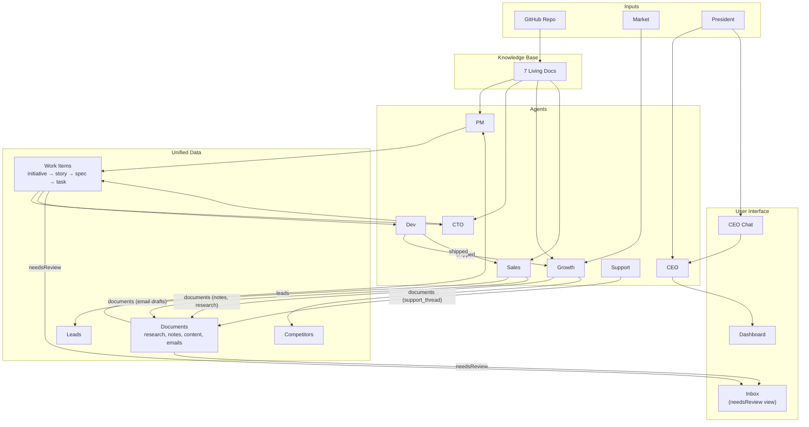

---

## 11. Knowledge Change Cascade

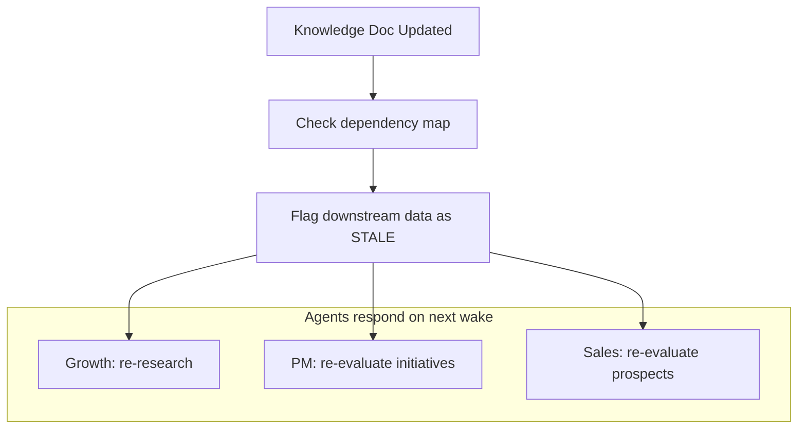
